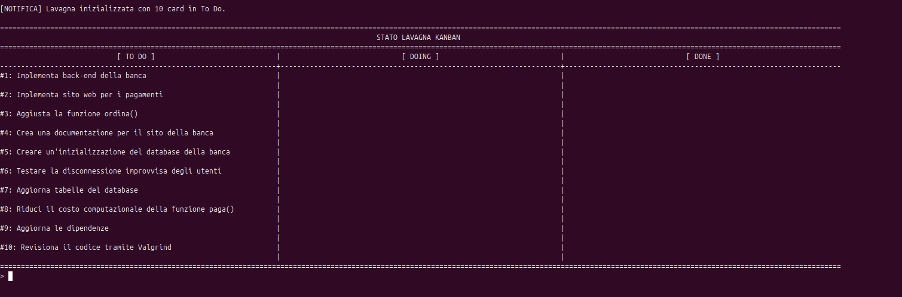
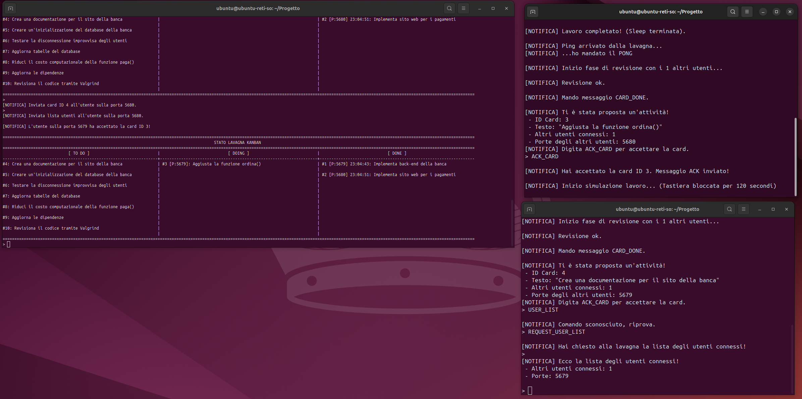

# Lavagna Kanban - Programmazione con Socket in C




## Descrizione
Applicazione distribuita sviluppata in **C** per simulare la gestione del lavoro tramite il metodo Kanban. 

Il progetto utilizza la programmazione di rete tramite **Socket** per far comunicare diverse entità (una lavagna centrale e più utenti worker) sullo stesso host. 

## Tecnologie Utilizzate
* **Linguaggio:** C
* **Networking:** Socket API (Architettura ibrida Client-Server e P2P)
* **Ambiente di Sviluppo e Testing:** Ubuntu 24


## Struttura del progetto
```bash
/
├── build/          # contiene i file oggetto .o                
├── doc/            # contiene la documentazione
├── include/        # contiene i vari header partizionati in moduli in base alle responsabilità
├── src/            # contiene i file sorgente .c
├── lavagna         # eseguibile della lavagna
├── utente          # eseguibile dell'utente
├── Makefile        # Makefile per la compilazione
└── README.md
```
## Specifiche di Progetto e Architettura

L'applicativo è strutturato in due entità principali che comunicano in locale sull'indirizzo IP `127.0.0.1`:

### 1. La Lavagna (Server)
* **Ruolo:** Funge da nodo centrale per tracciare lo stato dei lavori. È in ascolto fisso sulla porta `5678`.
* **Struttura Dati:** Gestisce un minimo di 10 "Card" (attività), indicizzate e posizionate in tre possibili colonne: `To Do`, `Doing` e `Done`.
* **Gestione Connessioni:** Tiene traccia degli utenti attualmente connessi, riconoscendoli tramite il loro numero di porta. Implementa un sistema di timeout: se un utente ha una card in lavorazione ma non risponde ai messaggi di `PING_USER`, la lavagna riassegna automaticamente la card alla colonna `To Do`.

### 2. Gli Utenti (Client / Worker)
* **Ruolo:** Rappresentano i nodi worker (almeno 4 istanze) che si collegano alla lavagna utilizzando porte incrementali a partire dalla `5679`.
* **Interazione Ibrida:** Gli utenti comunicano sia con la lavagna (per richiedere/accettare i task) sia tra di loro in modalità peer-to-peer (per la fase di revisione).

### Flusso di Esecuzione (Workflow Assegnazione e Review)
Il ciclo di vita di un'attività segue un protocollo di messaggistica rigoroso:
1.  **Registrazione:** All'avvio, l'utente invia un comando `HELLO` alla lavagna per notificare la sua presenza.
2.  **Assegnazione (Push):** La lavagna preleva una card dalla colonna `To Do` e la invia (tramite comando `HANDLE_CARD`) agli utenti connessi.
3.  **Presa in carico:** L'utente risponde con `ACK_CARD` per confermare la ricezione del task; la lavagna sposta quindi la card in `Doing`.
4.  **Fase di Review (Peer-to-Peer):** Prima di poter marcare il task come completato, l'utente interroga la lavagna per ottenere la lista aggiornata dei colleghi attivi (`REQUEST_USER_LIST`). Successivamente, contatta direttamente gli altri utenti inviando un messaggio `REVIEW_CARD` per ottenere l'approvazione.
5.  **Completamento:** Ricevuta la review dagli altri nodi, l'utente notifica la lavagna inviando `CARD_DONE`, e la card viene definitivamente spostata in `Done`.

## Compilazione ed Esecuzione

Il progetto è stato sviluppato e testato su ambiente **Ubuntu 24**.

Clona la repository in una cartella:
```bash
git clone https://github.com/coppola-giuseppe/Progetto-Reti-Informatiche.git
```

### 1. Compilazione
Apri il terminale nella root del progetto e digita:
```bash
make
```

### 2. Avvio del Sistema Distribuito
Poiché il sistema richiede l'esecuzione contemporanea di più processi indipendenti sullo stesso host, è necessario aprire più finestre o schede del terminale.


**Terminale 1 (Avvio della Lavagna):**

Avvia per prima la lavagna. Si metterà in ascolto sulla porta predefinita 5678:
```bash
./lavagna
```

**Terminali 2, 3, 4, 5, ... (Avvio degli Utenti):**
Apri altre istanze del terminale quanti sono gli utenti per simulare i nodi worker. 

Avvia ogni utente specificando una porta locale incrementale a partire dalla 5679:

```bash
# Nel Terminale 2
./utente 5679

# Nel Terminale 3
./utente 5680

# Nel Terminale 4
./utente 5681

# Nel Terminale 5
./utente 5682

...
```

## Documentazione

Per un'analisi approfondita delle scelte progettuali, dei protocolli di comunicazione e dell'architettura distribuita del sistema, consulta la [documentazione](docs/documentazione.pdf).